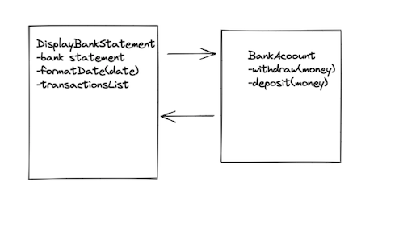
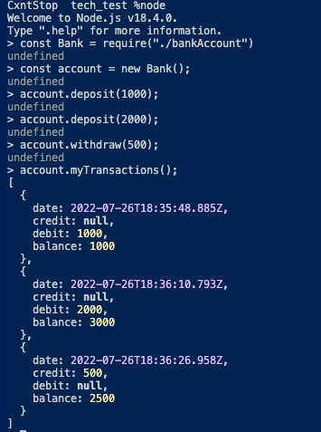

The Specification is shown below the header "Bank tech test".

You should be able to interact with your code via Node. (You don't need to implement a command line interface that takes input from STDIN.)

You would be able to deposit and withdraw money
You will be able to see account statement (date, amount, balance) printing.

Technologies 
It has been built on Javascript. 

It was built using TDD throughout. Testing technology was Node.

How To run locally:
git clone https://github.com/Hafizalimi7/bank_tech_test.git
npm install

#How To Test Program
- npx use node
- npm init -y
- npm install
- npm run tests
- jest --coverage

Testing:
To run the tests:
node

## Requirement
- You should be able to interact with your code via a REPL like IRB or Node. (You don't need to implement a command line interface that takes input from STDIN.)
- Deposits, withdrawal.
- Account statement (date, amount, balance) printing.
- Data can be kept in memory (it doesn't need to be stored to a database or anything).

## Acceptance criteria
- Given a client makes a deposit of 1000 on 10-01-2023
- And a deposit of 2000 on 13-01-2023
- And a withdrawal of 500 on 14-01-2023
- When the person prints a bank statement, then they would see

| input                    |  output    | 
| -------------------------- | ----------------- | 
| nothing                   | header |
| deposit(1000), on 10-01-2023 | header , 10-01-2023 | 
| deposit(2000), on 13-01-2023| header, 13-01-2023 | 
| withdraw(500), on 14-01-2023 | header, 14-01-2023 |

## Screenshots

